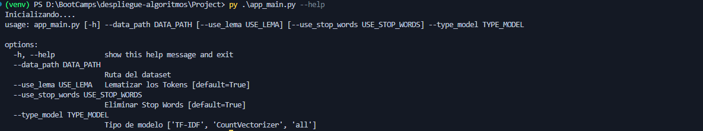
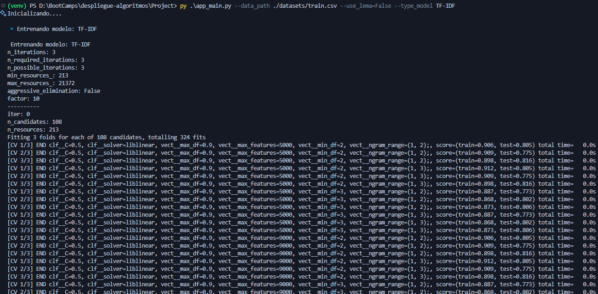
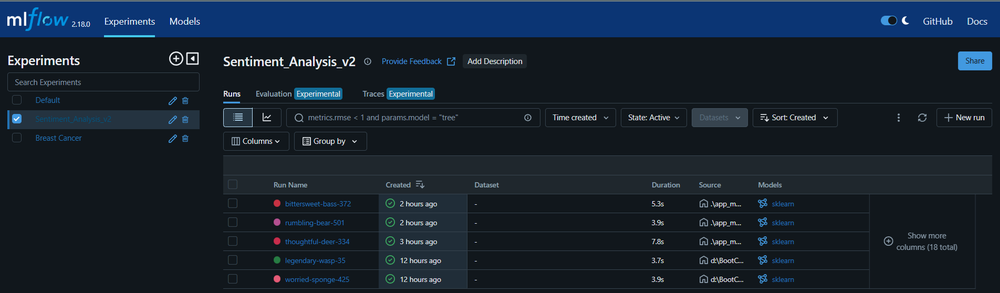
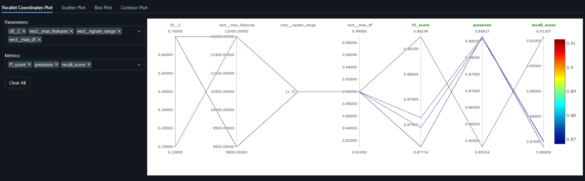
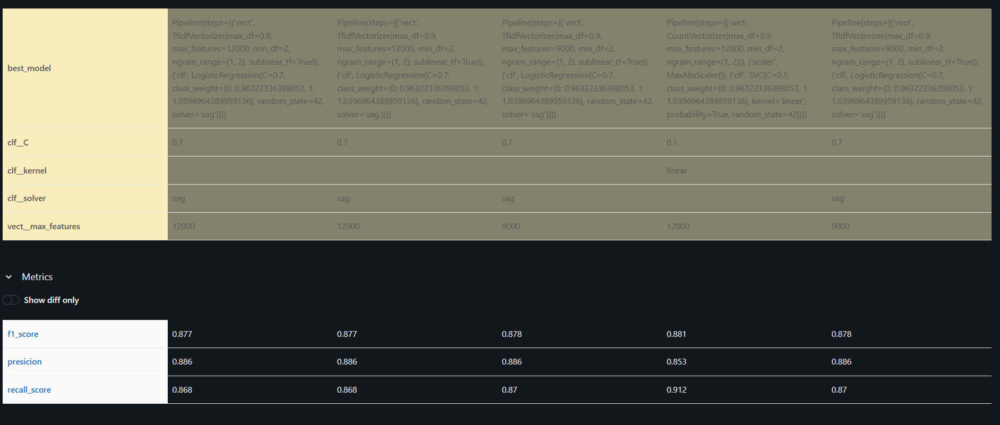

### Proyecto de Análisis de Sentimientos

#### 📌 Resumen

Este proyecto implementa un pipeline para el análisis de sentimientos utilizando diferentes técnicas de procesamiento de texto y modelos de clasificación. El objetivo principal es desarrollar un sistema de clasificación eficiente que no solo entrene y evalúe modelos de `Machine Learning`, sino que también implemente herramientas de `MLFlow` para:

- **Tracking**: Registrar el historial de experimentos con métricas clave como `accuracy`, `precision`, `recall` y `f1-score`.
- **Registro de Modelos**: Guardar los mejores modelos entrenados para futuras referencias o despliegues.
- **Gestión de Parámetros**: Almacenar hiperparámetros utilizados en el entrenamiento para facilitar la reproducibilidad.
- **Comparación de Resultados**: Permitir la evaluación de diferentes configuraciones y modelos a lo largo del tiempo.

##### 📂 Estructura de Archivos

- **`app_model.py`**  
  Contiene la clase `MModel` con la implementación de un pipeline que usa `TF-IDF` con `LogisticRegression` y `CountVectorizer` con `SVC`. También incluye el registro de modelos en `MLFlow`.

- **`app_class.py`**  
  Implementa la clase `Tokenizer`, encargada de realizar el preprocesamiento del texto, incluyendo tokenización y limpieza.

- **`app_main.py`**  
  Archivo principal del proyecto. Gestiona la carga de argumentos, el preprocesamiento del dataset y la ejecución del entrenamiento del modelo.

- **📂 `datasets/`**  
  Carpeta donde se almacenan los datasets utilizados en el análisis.

- **📂 `models/`**  
  Carpeta que contiene los modelos entrenados y guardados como los mejores (`best models`).

- **`requirements.txt`**  
  Archivo con las librerías necesarias para la ejecución del proyecto.

##### 🚀 Cómo Ejecutar el Proyecto

1. Instalar las dependencias:  
   ```bash
   pip install -r requirements.txt
   ```
2. Ver listado de argumentos
   ```bash  
    python app_main.py --help
   ```


3. Para entrenar el modelo, ejecutar el siguiente comando: 
 ```bash  
   python app_main.py --data_path ./datasets/train.csv --use_lema=True --type_model TF-IDF
 ``` 

##### 🔍 Algunas Visualizaciones

1. Consola parámetros app_main.py

  ```bahs
      python app_main.py --data_path ./datasets/train.csv --use_lema=True --type_model TF-IDF
  ``` 



2. Consola run script
 ```bash  
   python app_main.py --data_path ./datasets/train.csv --use_lema=True --type_model TF-IDF
 ``` 

 


3. Vista en MLFlow de experimentos




4. Vista en MLFlow de Compare Models




5. Vista resumen parámetro

