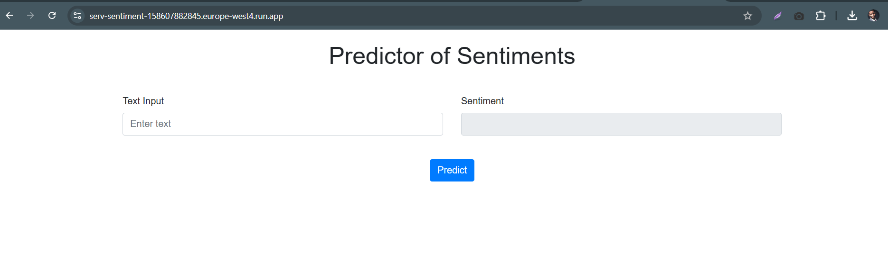
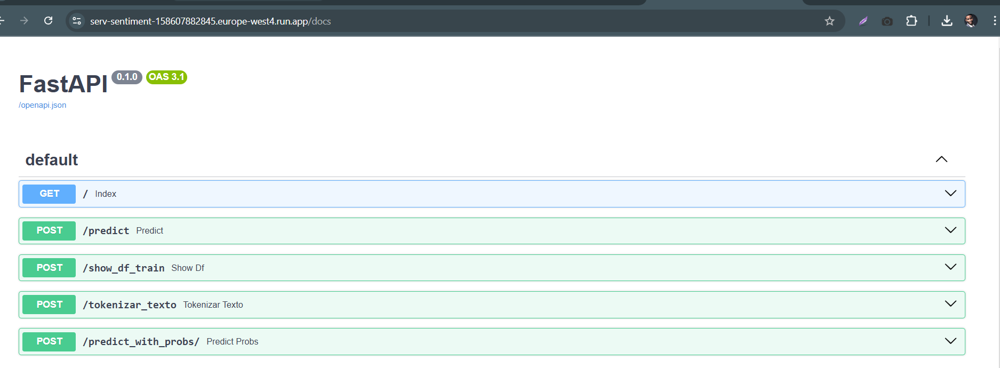
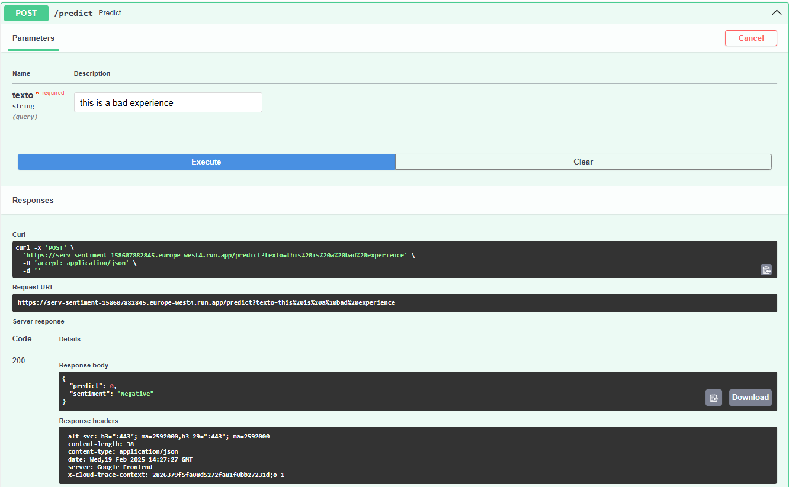
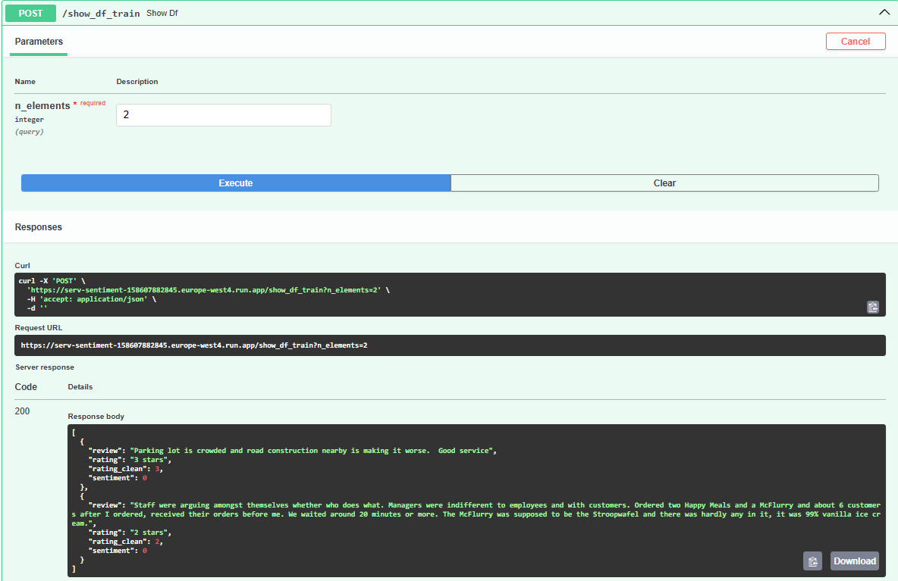
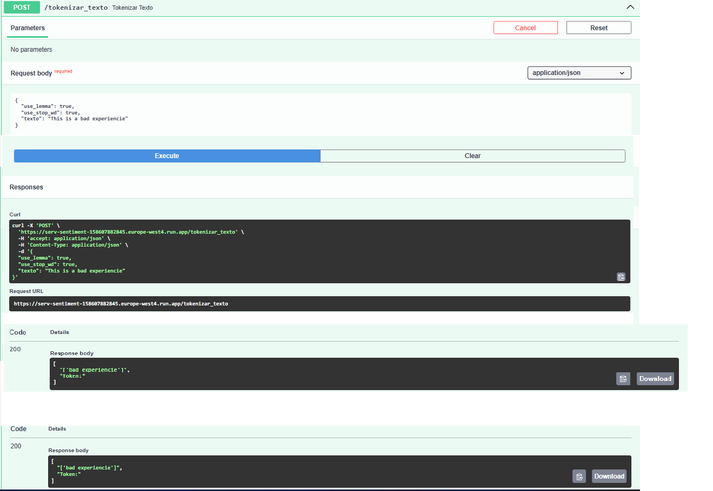
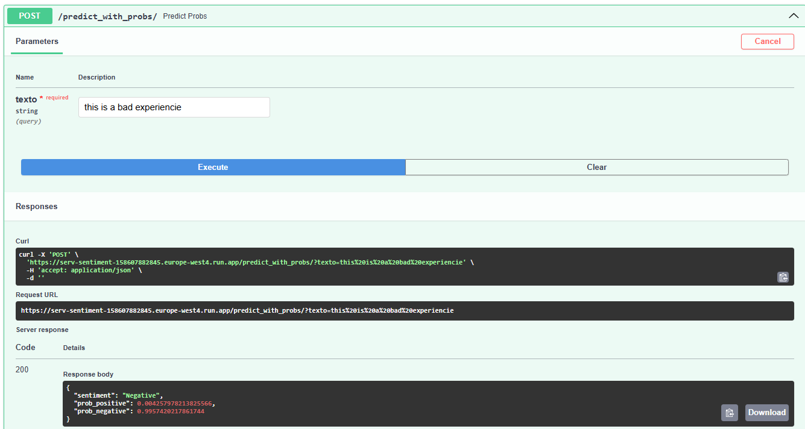
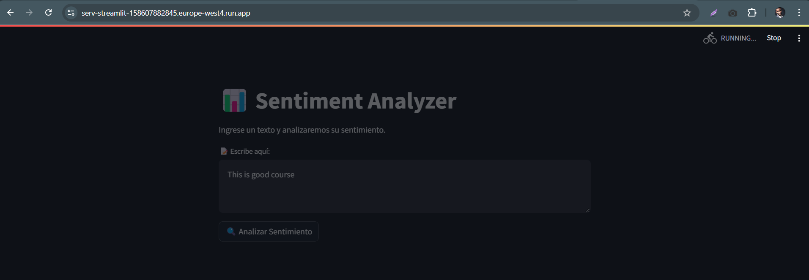
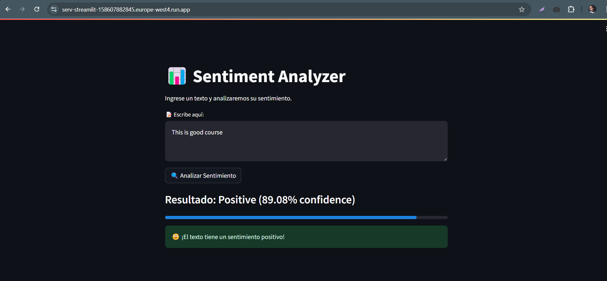
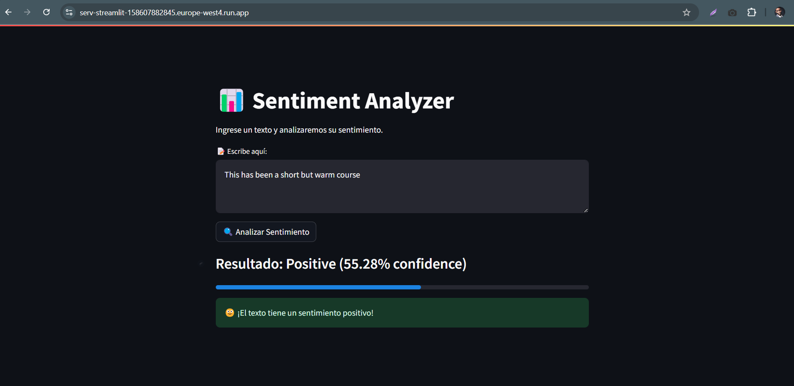

### Análisis de Sentimientos con TF-IDF, CountVectorizer, SVC, LogisticRegression, MLflow, FastAPI y Streamlit en GCP Cloud Run

Este proyecto implementa un **pipeline para el análisis de sentimientos**, utilizando diferentes técnicas de procesamiento de texto y modelos de clasificación. Se emplean herramientas como **MLflow** para el tracking y gestión del modelo.

#### 🚀 Tecnologías Utilizadas
- **TF-IDF y CountVectorizer**: Métodos para la extracción de características de texto, transformando documentos en representaciones numéricas 
- **Logisticregression y  SVC**: Algoritmos de clasificación; 
- **FastAPI**: API backend para la predicción de sentimientos.
- **Streamlit**: Aplicación frontend para visualizar y probar el modelo.
- **MLflow**: Registro, tracking y gestión de experimentos.
- **Docker & Docker Compose**: Contenerización y orquestación de servicios.

##### 📂 Estructura de Archivos

- **`app_model.py`**  
  Contiene la clase `MModel` con la implementación de un pipeline que usa `TF-IDF` con `LogisticRegression` y `CountVectorizer` con `SVC`. También incluye el registro de modelos en `MLFlow`.

- **`app_class.py`**  
  Implementa la clase `Tokenizer`, encargada de realizar el preprocesamiento del texto, incluyendo tokenización y limpieza.

- **`app_main.py`**  
  Archivo principal del proyecto. Gestiona la carga de argumentos, el preprocesamiento del dataset y la ejecución del entrenamiento del modelo.

- **📂 `datasets/`**  
  Carpeta donde se almacenan los datasets utilizados en el análisis.

- **📂 `models/`**  
  Carpeta que contiene los modelos entrenados y guardados como los mejores (`best models`).

- **📂 `fastapi_app/`** 
  Carpeta que contiene proyecto FastApi

- **📂 `streamlit_app/`** 
  Carpeta que contiene proyecto Streamlit

- **`requirements.txt`**  
  Archivo con las librerías necesarias para la ejecución del proyecto.


##### 🚀 Estructura del Proyecto FastApi

**FastAPI (`server.py`)**

Contiene cinco endpoints clave:
1. **`index`** → Página principal.
2. **`predict`** → Predicción de sentimientos para un texto.
3. **`show_df_train`** → Visualización de los primeros registros del dataset de entrenamiento.
4. **`tokenizar_texto`** → Tokenización de texto con preprocesamiento.
5. **`predict_with_probs`** → Predicción con probabilidades para obtener un análisis más detallado.

- **`test_docs_gcp.ipynb`**  
  Contiene las llamadas `https` a los modulos descritos antes.

Incluye un **Dockerfile** que permite desplegarlo en un contenedor.


##### 🚀 Estructura del Proyecto Streamlit

**Streamlit (`app.py`)**
Aplicación de interfaz gráfica simple para interactuar con el modelo de análisis de sentimientos.

Incluye su propio **Dockerfile** para despliegue en contenedor.


##### 🔍 Visualizaciones MLFlow

1. Consola parámetros app_main.py

  ```bahs
      python app_main.py --data_path ./datasets/train.csv --use_lema=True --type_model TF-IDF
  ``` 


2. Consola run script
 ```bash  
   python app_main.py --data_path ./datasets/train.csv --use_lema=True --type_model TF-IDF
 ``` 

 


3. Vista en MLFlow de experimentos


4. Vista en MLFlow de Compare Models


5. Vista resumen parámetro


##### 🔍 Visualizaciones FastApi

1. Index


2. Docs 



3. Respuesta dentro de Docs GCP Cloud Run









##### 🔍 Visualizaciones Streamlit






